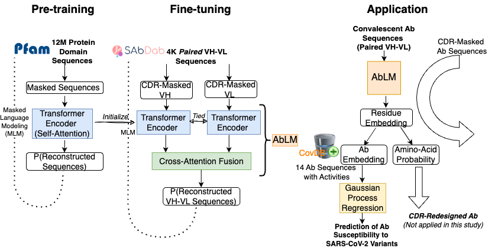

# COVID-Ab-LowDataRegime

This repository contains source codes and data for the preprint [Physics-driven structural docking and protein language models accelerate antibody screening and design for broad-spectrum antiviral therapy](https://www.biorxiv.org/content/10.1101/2024.03.01.582176v1)

## Step 1-1: Predict the structure of antibodies from the sequences. Then predict the docking complex using [HADDOCK](https://www.bonvinlab.org/software/haddock2.4/manual/) and our own Bayesian Active Learning ([BAL](https://github.com/Shen-Lab/BAL))
 - We calculated the ACE2 binding residues (to be protected by the antibodies), as 'ace2_binding_residue'
 - We used [AbodyBuilder](https://opig.stats.ox.ac.uk/webapps/sabdab-sabpred/sabpred/abodybuilder/) to predict the 3D structures of the antibodies from the sequence.
 - We used the [ProABC2](https://wenmr.science.uu.nl/proabc2/) to predict the binding residues on the antibodies side.
 - We used the [Haddock](https://www.bonvinlab.org/software/haddock2.4/manual/) to predict the antibody-SARS-Cov-2 binding complex.
 - We used [Bayesian Activate Learning](https://pubmed.ncbi.nlm.nih.gov/32558561/) to refine the docking complexes and get a 'confidence score' for each conformation of the same antibody.

## Step 1-2: Embed antibody sequences using our novel antibody language model, [AbLM](https://github.com/Shen-Lab/AbLM), that is pretrained with protein domain sequences, fine-tuned with paired VH-VL sequences, using antibody-specific masking during training.  
[Dedicated repository to AbLM](https://github.com/Shen-Lab/AbLM)

## Step 2: Predict the neutralization scores and the robustness to variants for all antibodies. All figures used in manuscripts are also generated using this jupyter notebook.
 - We calculated the weighted average of the coverage rate of the ACE2 binding residues for each antibody, as the predicted neutralization score 'wt_neutralization_score'.
 - We used the Kriging and the experimental variant EC50 fold changes to predict the antibody robustness, as 'kriging_prediction_results_delta', 'kriging_prediction_results_omicron_ba1' and 'kriging_prediction_results_omicron_ba5'.
